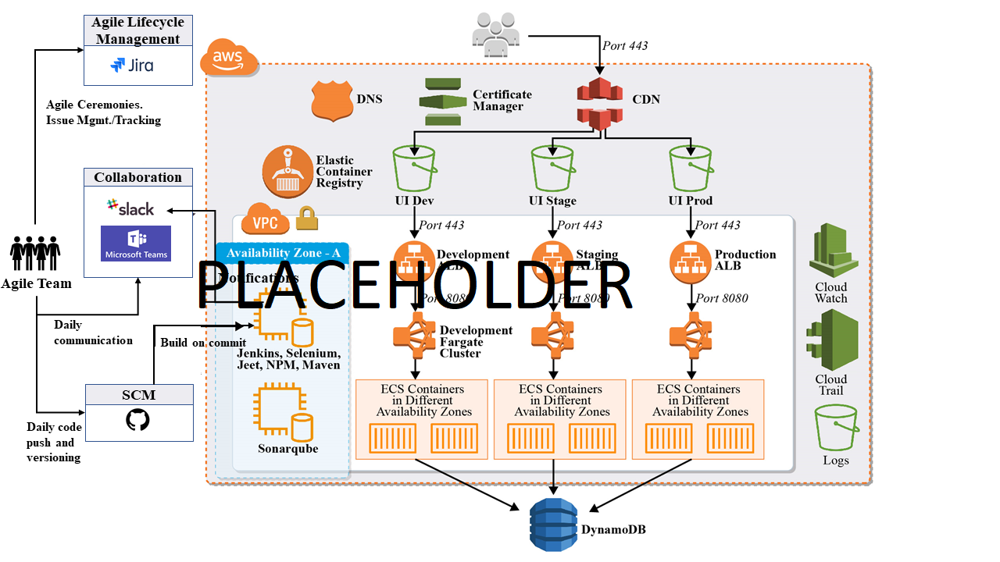

# WCST

## Overview
This application allows Verterans to submit their claim form (Form T4NG) via pdf upload through a self-service public web-application: the Widget Claims Submission Tool (WCST). 
The form is submitted directly to the Verterans Benefits Adminstration's (VBA) claims intake process via the Benefits Intake Application Programming INterface (API).

## Accessing live version of the application:  
https://prod.mblsto2020.com/

---

## Running application localy

1. Install [Docker Engine](https://docs.docker.com/engine/install/) for your platform. We strongly recommend Docker Desktop for [Mac](https://docs.docker.com/engine/install/) or [Windows](https://docs.docker.com/docker-for-windows/install/) users.
2. Install Git
3. Aquire VA API access key by going to [VA VA Lighthouse Developer Site](https://developer.va.gov/apply)
4. Clone the repository  `git clone -b master git@github.com:atlas-brownie/WCST.git --recurse-submodules` . This will create folder named WCST.
4. Navigate inside of the WCST folder.
5. Enter your VA testing credentials in to the file service/src/main/resources/application-local.yaml and update following properties
   - `vaAuthHeaderValue` With the apikey value.
   - `vaClaimIntakePointerUrl` Make sure it is pointing to sandbox box environment.
7) Launch Docker
8) Run the folowing command in the terminal:   
     `docker-compose up -d`
9) Access User interface in the browser by goign to: http://localhost:3000/
    

### Accessing local instance

* User Interface will be available under following url  
http://localhost:3000/

* API Specification is hosted   
http://localhost:8080/

---

WCST application consists of two main components, front-end and the back-end service. And uses Dynomodb database to persist the records.
To find more information about each, access thir respective readme files.
* [Front End](https://github.com/atlas-brownie/WCST-UI/blob/master/README.md)
* [Back End Service](https://github.com/atlas-brownie/WCST-Services/blob/master/README.md)

## Architecture Diagram

## Tech Stack
* Front end
  * TypeScript
  * React & Redux
* Back End 
  * Java 
  * Spring
